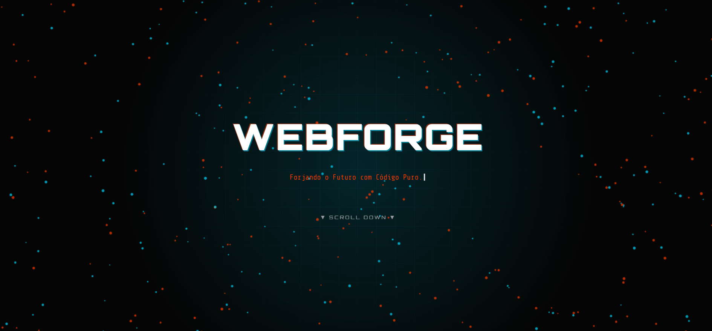
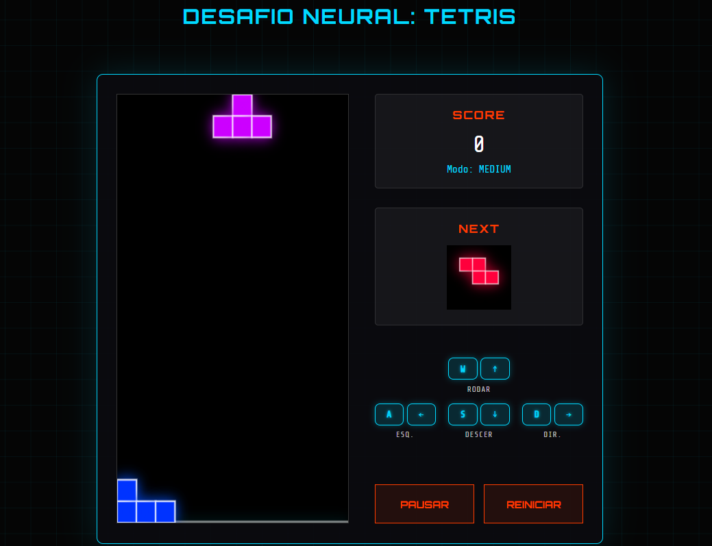

# 🌐 WebForge: Portfólio Full Stack Cyberpunk


> Um portfólio imersivo desenvolvido com tecnologias nativas da web, focado em performance, interatividade e design futurista.

---

## 🚀 Sobre o Projeto

O **WebForge** não é apenas um portfólio, é uma demonstração de capacidade técnica. O objetivo foi criar uma experiência completa de "Sistema Operacional Web" sem o uso de frameworks pesados (como React ou Angular), utilizando apenas o poder do **JavaScript Vanilla**.

O site simula um ambiente de desenvolvimento e entretenimento com **Web Development**.

### 🔗 [Clique aqui para acessar o Projeto Online](https://flaymezn.github.io/webforge-portfolio/)

---

## ✨ Funcionalidades Principais

### 🕹️ Arcade Hub (Engine de Jogos Própria)
Desenvolvimento de lógica de jogos do zero utilizando HTML5 Canvas:
* **Neon Tetris:** Implementação completa com sistema de rotação, colisão e *7-bag randomizer* para balanceamento de peças.

### 💻 Terminal CLI Interativo
Um simulador de terminal que aceita comandos reais:
* Comandos: `help`, `about`, `contact`, `date`, `cloud`.
* Resposta dinâmica e manipulação de strings.

### 📂 Sistema de Projetos (JSON Fetch)
* Simulação de consumo de API.
* Os dados dos projetos (título, imagem, código) são carregados de um arquivo `dados.json` externo.
* Renderização dinâmica do DOM baseada nos dados recebidos.

### 🎨 UI/UX Avançada (CSS3)
* **Glassmorphism & Neon:** Estilização moderna com brilhos e transparências.
* **Animações 3D:** Efeito "Tilt" nos cards que seguem o mouse.
* **Matrix Rain:** Efeito de chuva digital feito puramente em Canvas.
* **Áudio Sintetizado:** Efeitos sonoros gerados em tempo real via **Web Audio API** (sem arquivos .mp3 pesados).

---

## 🛠️ Tecnologias Utilizadas

* **Front-end:** HTML5 Semântico, CSS3 (Grid, Flexbox, Keyframes), JavaScript (ES6+).
* **Áudio:** Web Audio API (Oscillators e Gain Nodes).
* **Gráficos:** Canvas API (2D Context).
* **Dados:** JSON.

---

## 📸 Screenshots
Aqui estão algumas imagens do sistema em operação.

### [1. Visão Geral da Arquitetura]


### [2. Detalhe do Arcade Hub]

---

## 🚀 Como Rodar Localmente

1.  Clone o repositório:
    ```bash
    git clone [https://github.com/SEU-USUARIO/webforge-portfolio.git](https://github.com/SEU-USUARIO/webforge-portfolio.git)
    ```
2.  Entre na pasta:
    ```bash
    cd webforge-portfolio
    ```
3.  Abra com o VS Code:
    ```bash
    code .
    ```
4.  Utilize a extensão **Live Server** para rodar o projeto (necessário para o carregamento do JSON funcionar corretamente).

---

## 👨‍💻 Autor

Desenvolvido por **João Victor Carvalho** (FlameZn).
Apaixonado por Hardware, Cloud Engineering e Desenvolvimento Web.

[](https://www.linkedin.com/in/jvictor-carvalho-dev/)
[](mailto:jovitorzn@gmail.com)

---
*Projeto desenvolvido durante a Imersão Alura.*
